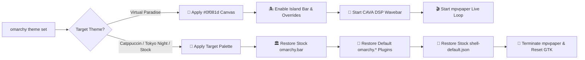

<div align="center">

```
██╗   ██╗██╗██████╗ ████████╗██╗   ██╗ █████╗ ██╗         ██████╗  █████╗ ██████╗  █████╗ ██████╗ ██╗███████╗███████╗
██║   ██║██║██╔══██╗╚══██╔══╝██║   ██║██╔══██╗██║         ██╔══██╗██╔══██╗██╔══██╗██╔══██╗██╔══██╗██║██╔════╝██╔════╝
██║   ██║██║██████╔╝   ██║   ██║   ██║███████║██║         ██████╔╝███████║██████╔╝███████║██║  ██║██║███████╗█████╗  
╚██╗ ██╔╝██║██╔══██╗   ██║   ██║   ██║██╔══██║██║         ██╔═══╝ ██╔══██║██╔══██╗██╔══██║██║  ██║██║╚════██║██╔══╝  
 ╚████╔╝ ██║██║  ██║   ██║   ╚██████╔╝██║  ██║███████╗    ██║     ██║  ██║██║  ██║██║  ██║██████╔╝██║███████║███████╗
  ╚═══╝  ╚═╝╚═╝  ╚═╝   ╚═╝    ╚═════╝ ╚═╝  ╚═╝╚══════╝    ╚═╝     ╚═╝  ╚═╝╚═╝  ╚═╝╚═╝  ╚═╝╚═════╝ ╚═╝╚══════╝╚══════╝
```

### 🌸 Virtual☆Paradise
**An audio-reactive, neon-infused Cyber Dark Purple desktop rice & development habitat.**

*Crafted for Omarchy Linux · Arch Linux · Hyprland · Quickshell · Wayland*

<br/>

[](https://archlinux.org)
[](https://hyprland.org)
[](https://github.com/mscurtescu/omarchy-island-bar)
[](https://github.com/llIIllIID0EIIllIIll/virtual-paradise)
[](https://github.com/ErikBurdett/omarchy-wavebar)
[](LICENSE)

<br/>

<a href="assets/preview-showcase.png">
  
</a>

*5-Terminal Development Rice with CAVA Audio Wavebar, 3-Island Floating Bar, Glitch Wallpaper Engine & Paradise Agent.*

</div>

---

## 🎨 The Aesthetic & Palette

Virtual☆Paradise is built on an ultra-deep, atmospheric cyber night canvas (`#0f081d`) illuminated by high-contrast neon accents inspired by futuristic anime cityscapes and vocaloid aesthetics.

| Color Swatch | Name | Hex Code | Role in Rice |
| :---: | :--- | :---: | :--- |
|  | **Cyber Dark Purple** | `#0f081d` | Universal canvas: Terminals, Shell, Panels, btop, Neovim, Helix |
|  | **Miku Cyan** | `#00f5d4` | Primary brand accent: Active borders, visualizer peaks, focus rings |
|  | **Sakura Pink** | `#ff5287` | Urgent indicators, secondary gradients, media titles, fastfetch logo |
|  | **Hacker Green** | `#00ff88` | Occupied workspace dots, success badges, memory pressure status |
|  | **Cyber Yellow** | `#ffe066` | Battery charging highlights, warnings, weather temperature pills |
|  | **Night Surface** | `#1c1038` | Card background, hover states, pill containers, dropdown menus |

---

## 🍱 Rice Architecture & Highlights

### 🏝️ 1. Cyber City 3-Island Floating Bar
Powered by `mscurtescu.island-bar` and extensively riced with custom QML vector styling:
- **Left Island**: Omarchy Quick Launch Menu, Japanese Numeral Workspaces (`io.github.tyrichards.workspaces-jap`), and Active Window Title.
- **Center Island**: Real-time CAVA Wavebar Media Controller (`io.github.erikburdett.wavebar`), Weather Pill, Clock & Date, System Telemetry Pill (`harshith.system-monitor`), and Status Indicators.
- **Right Island**: Projector & Wireless Display Cast (`io.github.jeffcortez23.omarchy-projector-cast`), PipeWire Audio Mixer (`ssupt.audio-control`), Bluetooth Routing (`ssupt.bluetooth-audio`), Multi-Monitor Configuration (`crmne.hyprmoncfg`), Power Manager (`onlyvishesh.power-manager`), and Notification Drawer.
- **Ricing Details**: Frosted dark acrylic glass with subtle neon SVG drop-shadows, responsive hover scaling, and clean micro-padding.

### 🌊 2. 60–120 FPS CAVA DSP Audio Wavebar
- **Hardware-Level Precision**: Powered by an asynchronous backend daemon (`waveform.py`) performing real-time CAVA DSP audio spectrum analysis over PipeWire.
- **Monstercat Frequency Smoothing**: Perfectly balanced 24-band logarithmic frequency curve for fluid visual response across all musical genres.
- **Dynamic Stream Detection**: Automatically attaches to active audio players (Firefox, Spotify, mpv, Chromium) and sleeps during silence to maintain <1% CPU overhead.
- **MPRIS Media Isolation**: Clicking controls audio playback without interrupting `mpvpaper` live video wallpapers.

### 🚀 3. 5-Terminal Development Rice (`SUPER + Q`)
Launches a deterministic, instant 5-pane Hyprland dwindle layout tuned for maximum aesthetic output:
1. **Pane 1 (Top Left)**: Fastfetch system telemetry with high-resolution anime Braille artwork and Paradise Agent prompt.
2. **Pane 2 (Top Right)**: `btop` system monitor themed in cyber dark purple with CPU/GPU thermal curves.
3. **Pane 3 (Bottom Left)**: `momoisay` fortune speaker with randomized cute anime cyber quotes.
4. **Pane 4 (Bottom Center)**: Terminal `cava` visualizer synchronized to active theme gradients.
5. **Pane 5 (Bottom Right)**: Tri-color gradient `virtual_matrix` digital rain (Cyan ➔ Green ➔ Pink).

### 🎬 4. Hardware-Accelerated Live Video Wallpaper Engine
- Seamless video & animated GIF loop playback via `mpvpaper` with hardware VA-API / NVDEC video decoding.
- **Cyber Glitch HUD Transition**: Cycling wallpapers (`SUPER + ALT + LEFT/RIGHT`) triggers a cyberpunk scanline HUD overlay with target filename, animated progress bar, and safety timeout.

### ❄️ 5. Embedded Controller (EC) Laptop Cooling
- Integrated fan overclocking and Cooler Boost for Acer Nitro (`acer-wmi`), ASUS ROG/TUF (`asusctl`), MSI (`isw`), and NBFC laptops via `SUPER + ALT + C`.
- Native NVIDIA GPU persistence management with calibrated power states.

### 🛡️ 6. Zero-Contamination Theme Switching
- Guaranteed **100% clean isolation**: Switching to stock Omarchy themes (`Catppuccin`, `Tokyo Night`, `Nord`, etc.) automatically disables all 3rd-party plugins, restores `omarchy.bar`, restores canonical `shell.json`, removes GTK overrides, and terminates live wallpapers.
- Switching back to `Virtual Paradise` re-enables all islands, audio visualizers, and custom styling instantly.



---

## 🛠️ Rice Specifications

| Category | Component | Configuration Details |
| :--- | :--- | :--- |
| **OS** | [Arch Linux](https://archlinux.org) / [Omarchy 4.0+](https://github.com/omarchy) | Rolling Release · Linux 6.x+ |
| **Compositor** | [Hyprland](https://hyprland.org) | Wayland · `cyberSpring` animations · Dual-layer blur |
| **Status Bar** | [Quickshell](https://outfoxxed.me/quickshell) | `mscurtescu.island-bar` 3-Island Floating Glassmorphism |
| **Audio Visualizer** | [Wavebar](https://github.com/ErikBurdett/omarchy-wavebar) + [CAVA](https://github.com/karlstav/cava) | 24-Bar DSP · Monstercat filter · PipeWire sink tracking |
| **Terminal** | [Ghostty](https://ghostty.org) | Primary terminal · `#0f081d` background · Zsh + Starship |
| **Alternative Terminals** | Alacritty · Kitty · Foot | Fully synchronized with Virtual Paradise palette |
| **Font** | JetBrains Mono Nerd Font | 9pt · High legibility · Symbol ligatures |
| **File Manager** | Nautilus | Styled with Libadwaita Cyberpunk GTK 3/4 CSS |
| **Live Wallpaper** | `mpvpaper` | Hardware-decoded video loops (`Miku_live.mp4`) |
| **System Monitor** | `btop` | Custom dark purple theme with hardware thermal sensors |

---

## ⌨️ Essential Keybindings

### 🪟 Window & Workspace Controls
| Shortcut | Action |
| :--- | :--- |
| `SUPER + Return` | Open Ghostty terminal emulator |
| `SUPER + Q` | **Launch 5-Terminal Development Rice** |
| `SUPER + E` | Open Nautilus file manager |
| `SUPER + B` | Open default web browser |
| `SUPER + C` | Close focused window |
| `SUPER + V` | Toggle floating window mode |
| `SUPER + F` | Toggle fullscreen |
| `SUPER + 1..9` | Switch to workspace 1..9 (with Japanese indicator updates) |
| `SUPER + SHIFT + 1..9` | Move window to workspace 1..9 |

### 🎬 Wallpaper & Environment
| Shortcut | Action |
| :--- | :--- |
| `SUPER + ALT + UP` | Toggle Live Video Wallpaper / Static Art |
| `SUPER + ALT + RIGHT` | Next live wallpaper (Cyberpunk Glitch HUD) |
| `SUPER + ALT + LEFT` | Previous live wallpaper (Cyberpunk Glitch HUD) |
| `SUPER + N` | Cycle next static theme background |

### ⚡ Hardware & Utilities
| Shortcut | Action |
| :--- | :--- |
| `SUPER + ALT + C` | **Toggle Cooler Boost (High-Velocity Fan Cooling)** |
| `SUPER + SHIFT + K` | Launch Wireless Display / Projector Cast |
| `SUPER + SHIFT + T` | Open Omarchy Theme Picker |
| `SUPER + SHIFT + C` | Color picker with HEX copy to clipboard |
| `SUPER + \` | Fullscreen Matrix Screensaver |
| `SUPER + ALT + V` | Toggle Voxtype Aura Voice Dictation |

---

## 📦 Integrated Quickshell Plugins

Virtual☆Paradise coordinates modular Quickshell plugins without hardcoding or conflicting with system files:

| Plugin ID | Function |
| :--- | :--- |
| [`mscurtescu.island-bar`](https://github.com/mscurtescu/omarchy-island-bar) | Cyber City 3-Island floating bar with gradient vector borders |
| [`io.github.erikburdett.wavebar`](https://github.com/ErikBurdett/omarchy-wavebar) | 120Hz real-time CAVA waveform with MPRIS track control |
| [`io.github.tyrichards.workspaces-jap`](https://github.com/TyRichards/omarchy-workspaces-jap) | Japanese numeral workspace indicators with active underline |
| [`io.github.adamcbrewer.voxtype-aura`](https://github.com/adamcbrewer/voxtype-aura) | Theme-aware voice dictation HUD overlay |
| [`crmne.hyprmoncfg`](https://github.com/crmne/omarchy-hyprmoncfg) | Multi-monitor display management & per-output scaling |
| [`harshith.system-monitor`](https://github.com/Harshith292002/omarchy-system-monitor) | Theme-rice system monitor replacing standard memory widget |
| [`onlyvishesh.power-manager`](https://github.com/onlyVishesh/omarchy-power-manager) | Battery health telemetry and power profiles |
| [`ssupt.audio-control`](https://github.com/ssupt/omarchy-audio-control) | PipeWire stream mixer, device selection, and volume curves |
| [`ssupt.bluetooth-audio`](https://github.com/ssupt/omarchy-bluetooth-audio) | Bluetooth audio device management with LDAC/aptX selection |
| [`io.github.jeffcortez23.omarchy-projector-cast`](https://github.com/JeffCortez23/omarchy-projector-cast) | Wireless display casting and presentation mode |
| [`jankeesvw.notification-center`](https://github.com/jankeesvw/omarchy-notification-center) | Notification drawer and Do-Not-Disturb control |

---

## 🚀 Installation

### Automated Install (Recommended)

```bash
git clone https://github.com/llIIllIID0EIIllIIll/virtual-paradise.git
cd virtual-paradise
./install.sh
```

### Modular Flags

| Command | Description |
| :--- | :--- |
| `./install.sh` | **Full Installation**: Deploys themes, plugins, SDDM, and Plymouth boot animations. *(Prompts for sudo when needed)* |
| `./install.sh --user-only` | **User Only**: Installs desktop rice, plugins, and configs without requiring sudo privileges. |
| `./install.sh --no-boot` | Deploys desktop theme and plugins while skipping Plymouth and SDDM setup. |
| `./install.sh --hook` | Fast-syncs plugin overrides and assets without re-checking dependencies. |

### Clean Uninstallation Guarantee

We believe rice should always be respectful of the host machine:

```bash
# From repository:
./uninstall.sh

# Or via installed command:
uninstall-virtual-paradise
```

The uninstaller gracefully switches the active theme back to a fallback theme (Catppuccin, Tokyo Night, etc.), restores stock `shell.json`, re-enables all official `omarchy.*` widgets, removes theme files, and leaves zero residual background processes.

---

## 🧪 Automated Test Matrix

All releases are verified against our end-to-end test suite:

- **TC-1: Script Syntax & Static Code Analysis** — `bash -n`, `py_compile`, and `jq` schema validation.
- **TC-2: Uninstaller Coexistence** — Non-destructive cleanup, backup creation, and clean widget restore.
- **TC-3: Installer Idempotency** — Safe multi-run execution without duplicating configs or corrupting state.
- **TC-4: Theme Switching Isolation** — Full round-trip testing (`Virtual Paradise ➔ Catppuccin ➔ Virtual Paradise`) with zero bleed.
- **TC-5: Audio Capture & DSP Engine** — PipeWire sink tracking and 120Hz waveform stability under heavy playback.
- **TC-6: Palette Uniformity** — Exact `#0f081d` canvas matching across Ghostty, Alacritty, Kitty, Foot, and Shell.

---

## 📂 Repository Structure

```text
virtual-paradise/
├── assets/          # High-resolution screenshots, showcase artwork & badges
├── backgrounds/     # Video loops (Miku_live.mp4) and 4K cyberpunk wallpapers
├── bin/             # Launchers, CAVA sync daemon, matrix effect & helpers
├── cava/            # CAVA visualizer configuration and gradient palettes
├── config/          # Modern GTK 3/4 CSS overrides and terminal configs
├── fastfetch/       # Fastfetch profile with high-res Anime Braille artwork
├── hypr/            # Hyprland window rules, gestures, and cyber animations
├── overrides/       # Scoped QML overrides for Island Bar, Wavebar, Workspaces & Aura
├── plugins/         # User Quickshell widgets cloned for active user namespace
├── plymouth/        # Plymouth boot & shutdown splash animation assets
├── sddm/            # SDDM cyberpunk login display theme
├── shell/           # 3-Island Quickshell layout configuration (shell.json)
├── theme/           # Master color palettes (colors.toml, shell.toml) & app configs
├── install.sh       # Idempotent automated installer with multi-mode flags
└── uninstall.sh     # Clean uninstaller with automatic fallback restoration
```

---

<div align="center">

Made with 💜 for the **Omarchy Linux**, **Arch Linux**, and **r/unixporn** communities.

[Back to top ↑](#-virtualparadise)

</div>
