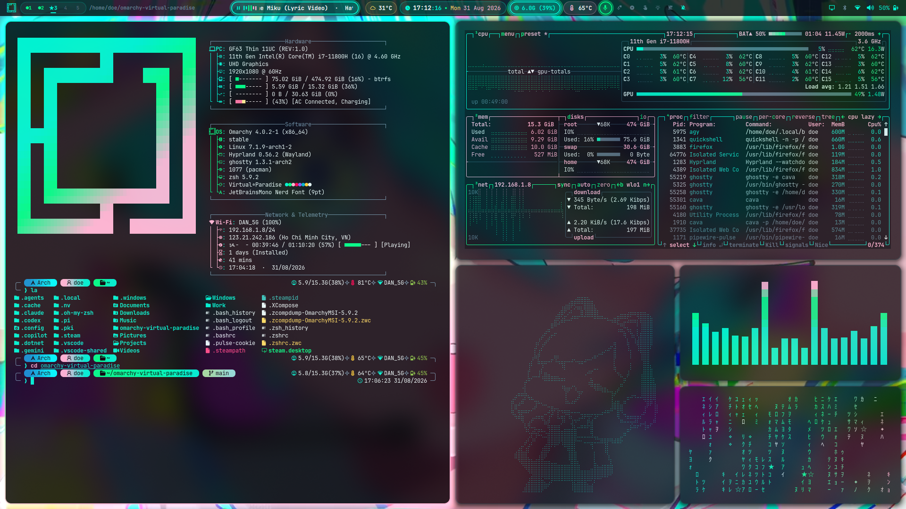

# 🌸 Virtual☆Paradise

> **Full-Topping Cyberpunk Rice & Universal Theme for Omarchy Linux (Arch Linux + Hyprland)**  
> *Tri-Color Palette: 40% Miku Cyan (`#00f5d4`) · 20% Hacker Green (`#00ff88`) · 40% Sakura Pink (`#ffb7d5`)*

[](https://archlinux.org)
[](https://hyprland.org)
[](https://github.com/outfoxxed/quickshell)
[](LICENSE)

---

## 📸 Overview & Aesthetic Philosophy

**Virtual☆Paradise** transforms your Arch Linux / Omarchy desktop into a high-performance, neon-pastel cyberpunk command center. Designed with meticulous attention to detail, every element—from hardware fan cooling to terminal omnisearch, live video wallpaper transitions, and full boot-to-shutdown cinematic animations—delivers fluid 60fps animations, glassmorphism transparency, and rich TrueColor ergonomics.



---

## ✨ Key Architectural Innovations & Features

### 1. 🎬 Cinematic Portal Curtain Live Wallpaper Engine
* **Hardware-Accelerated 60fps GPU Playback:** Seamlessly plays live video (`Miku_live.mp4`) and animated GIFs (`Miku_missing.gif`, `Miku_animated_full.gif`, `Miku_animated1.gif`, `Miku_animated2.gif`, `Miku_animated3.gif`, `Miku_animated4.gif`) via `mpvpaper` with negligible idle CPU impact.
* **Dual-Curtain Close & Reveal:** Switching wallpapers triggers a custom Quickshell overlay (`curtain_transition.qml`) where the `Portal.jpg` curtain panels close inward from both sides meeting in the center (`Easing.OutCubic`), swap the wallpaper behind the scenes, and part down the middle outward to both sides (`Easing.InCubic`).
* **Layer Hierarchy (`WlrLayer.Bottom`):** The transition operates above the wallpaper canvas while staying below the top status bar.
* **Directional D-Pad Navigation & Playlist Order:**
  * `SUPER + ALT + UP`: Toggle Live Wallpaper on/off (switches to `Miku_missing.jpg` static fallback).
  * `SUPER + ALT + RIGHT`: Next Live Wallpaper in playlist (`Miku_live.mp4` [default] ➔ `Miku_missing.gif` ➔ `Miku_animated_full.gif` ➔ `Miku_animated1.gif` ➔ `Miku_animated2.gif` ➔ `Miku_animated3.gif` ➔ `Miku_animated4.gif`).
  * `SUPER + ALT + LEFT`: Previous Live Wallpaper in playlist.

---

### 2. 🔒 Cyberpunk Animated Lockscreen (`[user].lock`)
* **Native QtQuick Animated Image:** Custom Quickshell session lock plugin displaying full-screen 1080p `Sleeping_miku.gif` with zero blur or lag.
* **Live Neon HUD Clock & Date:** Glowing Miku Cyan (`#00f5d4`) digital clock and Sakura Pink (`#ffb7d5`) calendar header.
* **Linux `fortune` Wisdom Engine:** Automatically invokes `fortune -s` to display dynamic system wisdom, programming jokes, and Linux aphorisms, auto-refreshing every 10 seconds.
* **Acrylic Glassmorphism Password Input:** Rounded input surface positioned at the bottom with neon green masked dots (`#00ff88`).

---

### 3. 🚀 Cinematic Boot & Shutdown Animation Engine
* **Boot & LUKS Encryption Screen (`Miku_animated_full.gif`):**
  * Plays the full 259-frame 1080p animation at native ~9.09 FPS during Plymouth boot and disk decryption.
  * **Instant Lazy-Loading Architecture:** Frame 1 renders in `<15ms` with `0s` startup delay. Subsequent frames load on-demand, preventing multi-gigabyte RAM spikes and CPU lockups.
  * **Minimalist Aesthetic:** Password entry box is anchored at the bottom edge, leaving Miku 100% visible with zero obscuring text or logos.
  * **SDDM Display Manager:** QtQuick6 login screen natively renders `Miku_animated_full.gif` with 20% acrylic darkness overlay.
* **Seamless Fullscreen Outro Shutdown (`Miku_missing.gif`):**
  * Plays 72-frame Miku outro animation on desktop and carries through Plymouth until hardware poweroff.
  * **Zero Black Screen Handover:** Custom systemd service drop-ins eliminate the 2-second SDDM wait gap, enabling Plymouth to claim DRM immediately upon session exit.
  * **Cyberpunk Gradient Statusline:** Glowing `󰐥 Shutting down system...` status rendered in horizontal Miku Cyan ➔ Hacker Green ➔ Sakura Pink gradient.

---

### 4. ⚡ 5-Terminal Development Rice (`SUPER + Q`)
Launches a complete 5-pane cyberpunk development workspace in microseconds via Wayland socket dispatch:
1. 🖥️ **`fastfetch`** — Master left panel with system information and high-res anime Braille logo.
2. 📊 **`btop`** — Top-right real-time CPU, GPU, memory, and process monitor in TrueColor.
3. 🌸 **`momoisay`** — Center-bottom animated Saiba Momoi ASCII mascot dialogue in glowing Cyan.
4. 🎵 **`cava`** — Bottom-right 8-band audio spectrum visualizer.
5. 👾 **`virtual_matrix`** — Tri-color cyber matrix rain (Cyan ➔ Green ➔ Sakura Pink).

---

### 5. 🔍 Unified Search☆Hub (`f` Command)
* **100% Nerd Font Standardization:** Fully decorated with crisp Nerd Font glyphs (`󰍉`, ``, `󰈙`, ``, ``, ``).
* **Omnisearch Pipeline:** Single unified search engine prioritizing:
  1. ` ` Directories (`fd -t d`) $\rightarrow$ Instant `cd`
  2. `󰈙 ` Files (`fd -t f`) $\rightarrow$ Multi-select file editor open (`micro`)
  3. ` ` Text inside files (`rg`) $\rightarrow$ Direct jump to matched line number
* **Adaptive Live Preview:** Real-time directory trees (`eza`), syntax-highlighted code (`bat`), and line previews.
* **Hierarchical `[←]` Back Navigation:** Seamlessly browse upward through parent folders or return to Search☆Hub.

---

### 6. 📝 Micro Editor Cyberpunk Rice
* **TrueColor Theme:** `virtual-paradise.micro` custom color palette with syntax highlighting, diff gutter, and line numbers.
* **Statusline:** Customized Nerd Font status bar (`󰈙 filename · 󰄬 Ln X, Col Y`).

---

### 7. ❄️ Hardware Cooler Boost (`SUPER + C`)
* **Instant Thermal Management:** One-key toggle that drives laptop/desktop cooling fans to maximum RPM, displaying an on-screen desktop OSD.

---

### 8. 🚨 Window Error Shake & Neon Red Border Hook
* When any terminal command returns a non-zero exit code, Hyprland automatically shakes the active window and turns its border glowing neon red.

---

## ⌨️ Ergonomic Keybindings & Shortcuts

| Shortcut | Action | Description |
| :--- | :--- | :--- |
| `SUPER + Q` | **Rice Layout** | Launches 5-terminal workspace (Fastfetch, Btop, Momoisay, Cava, Matrix) |
| `SUPER + ALT + UP` | **Toggle Live Wallpaper** | Switches between Live Video/GIF and static `Miku_missing.jpg` |
| `SUPER + ALT + RIGHT` | **Next Live Wallpaper** | Cycles to next live wallpaper with Portal curtain wipe transition |
| `SUPER + ALT + LEFT` | **Prev Live Wallpaper** | Cycles to previous live wallpaper with Portal curtain wipe transition |
| `SUPER + N` | **Next Wallpaper** | Cycles to next Omarchy theme background |
| `SUPER + C` | **Toggle Cooler Boost** | Toggles maximum fan cooling on/off |
| `SUPER + E` | **File Manager** | Auto-detects default file manager (`xdg-open`) |
| `SUPER + B` | **Web Browser** | Launches default web browser |
| `SUPER + SHIFT + T` | **Theme Switcher** | Opens interactive theme selector menu |
| `SUPER + SHIFT + C` | **Color Picker** | Magnifier with auto hex copy |
| `SUPER + \` | **Matrix Screensaver** | Fullscreen Cyberpunk Matrix in terminal |
| `SUPER + CTRL + L` | **Lock Screen** | Locks screen with Sleeping Miku animated HUD |
| `f` *(in terminal)* | **Search☆Hub** | Unified Explorer, Command History & Process Manager |
| `ffa` *(in terminal)* | **Fastfetch Anime** | High-res 65-line Braille anime art with 24-bit TrueColor gradient |

---

## 📂 Repository Directory Layout

```
omarchy-virtual-paradise/
├── backgrounds/                # Live video streams, animated GIFs & static wallpapers
│   ├── Miku_animated_full.gif  # 1080p Miku boot / SDDM login animated wallpaper (259 frames)
│   ├── Miku_animated1.gif      # 1080p anime animated wallpaper (504 frames)
│   ├── Miku_animated2.gif      # 1080p anime animated wallpaper (144 frames)
│   ├── Miku_animated3.gif      # 1080p anime animated wallpaper (72 frames)
│   ├── Miku_animated4.gif      # 1080p anime animated wallpaper
│   ├── Miku_live.mp4           # Hatsune Miku 1080p 60fps live video wallpaper (Default)
│   ├── Miku_missing.gif        # 1080p Miku shutdown / logout animated wallpaper (72 frames)
│   ├── Miku_missing.jpg        # Default 1080p static Cyberpunk fallback artwork
│   └── Portal.jpg              # Curtain transition artwork (3840x1080)
├── bin/                        # CLI helper tools, orchestrators & transition overlays
│   ├── curtain_transition.qml  # Quickshell Portal drop & dual-split transition overlay
│   ├── hypr_window_error_restore.sh # Window error border restore helper
│   ├── hypr_window_error_shake.sh   # Window shake & glowing red error hook
│   ├── logout_splash.qml       # Fullscreen Miku outro shutdown / logout animated splash
│   ├── memory_detail_notify.sh # Memory detail desktop notification dispatcher
│   ├── Miku_missing.gif        # Standalone asset for logout splash runner
│   ├── momoisay                # Animated Saiba Momoi ASCII mascot dialogue generator
│   ├── omarchy-system-logout   # Animated logout wrapper with Miku outro
│   ├── omarchy-system-reboot   # Animated reboot wrapper with Miku outro
│   ├── omarchy-system-shutdown # Animated shutdown wrapper with Miku outro
│   ├── Portal.jpg              # Relative asset for standalone transition runner
│   ├── rice_layout.sh          # 5-terminal workspace automated orchestrator
│   ├── toggle_btop.sh          # Toggle floating Btop system monitor
│   ├── toggle_cooler_boost.sh  # Hardware fan Cooler Boost controller
│   ├── toggle_live_wallpaper.sh# Live wallpaper playlist engine & curtain caller
│   ├── toggle_voxtype_config.sh# Toggle Voxtype voice-to-text dictation config
│   └── virtual_matrix.py       # Tri-color Cyberpunk matrix rain generator
├── cava/                       # Audio spectrum visualizer configurations
│   ├── config                  # Full terminal Cava configuration
│   └── config_bar              # Lightweight status bar Cava widget configuration
├── fastfetch/                  # Fastfetch system info & anime ASCII artworks
│   ├── config.jsonc            # Clean fastfetch profile layout
│   ├── logo.txt                # Fastfetch fallback logo
│   └── logo_anime.txt          # High-res 65-line Braille Anime ASCII artwork
├── hypr/                       # Hyprland user system configuration
│   ├── autostart.lua           # Startup daemons, agents & wallpaper initialization
│   ├── bindings.lua            # Complete ergonomic keyboard shortcuts & D-Pad
│   ├── hyprland.lua            # User-level Hyprland bootstrap & window rules
│   ├── input.lua               # Touchpad, mouse acceleration & keyboard layout
│   ├── looknfeel.lua           # Gaps, rounded corners, blur & spring physics animations
│   └── monitors.lua            # Display resolutions, refresh rates & layout
├── micro/                      # Micro editor cyberpunk customization
│   ├── colorschemes/           # TrueColor theme: virtual-paradise.micro
│   └── settings.json           # Micro preferences, statusline & syntax config
├── plugins/                    # Customized Omarchy Quickshell plugins (Auto-calibrated to [user].*)
│   ├── active-window/          # Active window title bar widget
│   ├── audio/                  # Audio volume & output switcher
│   ├── background/             # Background service manager
│   ├── bluetooth/              # Bluetooth device manager
│   ├── clock/                  # Live clock, date & calendar
│   ├── cputemp/                # CPU temperature & cooler boost
│   ├── indicators/             # System indicator icons (recording, night light, DND)
│   ├── lock/                   # Sleeping Miku lockscreen & fortune quotes engine
│   ├── media/                  # MPRIS media player controller
│   ├── memory/                 # RAM / Swap memory monitor & btop launcher
│   ├── menu/                   # Omarchy quick applications menu
│   ├── microphone/             # Microphone mute & volume controller
│   ├── monitor/                # Display brightness & resolution manager
│   ├── network/                # Wi-Fi & Ethernet network manager
│   ├── power/                  # Battery & power profile widget
│   ├── system-update/          # System update notification widget
│   ├── weather/                # Weather forecast widget
│   └── workspaces/             # Workspace switcher & window indicators
├── plymouth/                   # Plymouth boot & shutdown theme configuration
│   ├── omarchy.script          # Instant lazy-loading Plymouth animation engine
│   └── override.conf           # Systemd service drop-in (zero black screen delay)
├── sddm/                       # SDDM login display manager theme configuration
│   └── Main.qml                # Animated login interface with Miku_intro.gif
├── shell/                      # Shell configurations & status bar layouts
│   ├── shell.json              # Status bar layout (transparency off, custom modules)
│   └── zshrc                   # Cyberpunk Zsh configuration with Search☆Hub & aliases
├── alacritty.toml              # Alacritty terminal theme profile
├── btop.theme                  # Btop TrueColor theme profile
├── chromium.theme              # Chromium browser theme profile
├── colors.css                  # CSS color variable definitions
├── colors.toml                 # Master TrueColor palette definitions
├── foot.ini                    # Foot terminal theme profile
├── ghostty.conf                # Ghostty terminal theme profile
├── gtk.css                     # GTK 3/4 custom cyberpunk theme styling
├── gum_env.lua                 # Gum environment configuration
├── helix.toml                  # Helix editor theme profile
├── hyprland.conf               # Theme-level window rules fallback
├── hyprland.lua                # Theme-level window decoration & animation rules
├── hyprland-preview-share-picker.css # Screen sharing picker dialog styles
├── hyprlock.conf               # Theme lock screen color overrides
├── icons.theme                 # Icon theme definition
├── install.sh                  # Automated, idempotent 10-step installation script
├── keyboard.rgb                # RGB keyboard backlighting profile
├── kitty.conf                  # Kitty terminal theme profile
├── LICENSE                     # MIT License
├── neovim.lua                  # Neovim color profile
├── preview.png                 # Theme screenshot
├── README.md                   # Comprehensive project documentation
├── shell.toml                  # Shell environment variables
├── unlock.png                  # Master unlock logo
├── vscode.json                 # VS Code theme configuration
└── vscode-theme.json           # VS Code color token definitions
```

---

## 🚀 Installation Guide

### Option 1: Full Automated Installation (Recommended)

Clone the repository and run the automated installer:

```bash
git clone https://github.com/llIIllIID0EIIllIIll/virtual-paradise.git
cd virtual-paradise
chmod +x install.sh
./install.sh
```

The installer will execute **10 comprehensive steps**:
1. Verify and install missing packages (`cava`, `btop`, `fastfetch`, `micro`, `fortune-mod`, `mpvpaper`, `ripgrep`, `fd`, `ffmpeg`, etc.).
2. Create runtime directories and backup existing configurations.
3. Calibrate and install all 18 Quickshell plugins dynamically for your username (`${USER}.*`).
4. Configure status bar layout and quick action menu extensions.
5. Deploy Hyprland keybindings, look'n'feel, and autostart scripts.
6. Install CLI helper tools and wrappers to `~/.local/bin/`.
7. Install component themes (Cava, Btop, Fastfetch, Micro).
8. Synchronize theme assets and wallpaper playlists.
9. **Configure Plymouth boot animation, SDDM display manager & rebuild UKI / initramfs** (prompts for sudo).
10. Configure `~/.zshrc` / `~/.bashrc` with Search☆Hub and error shake hooks.

---

### Option 2: Selective Installation Flags

* **User-Space Only (No sudo required):**
  ```bash
  ./install.sh --no-boot
  ```
  Installs all Hyprland configs, Quickshell plugins, terminal themes, Search☆Hub, and live wallpapers without touching system files or rebuilding the UKI.

* **Boot & Shutdown Animations Only:**
  ```bash
  sudo ./install.sh --boot-only
  ```
  Deploys the Plymouth lazy-loading animation engine, SDDM animated login screen, systemd drop-ins, and regenerates the UKI kernel image.

---

## 📜 License

This project is licensed under the [MIT License](LICENSE).  
Made with 💖 for the Omarchy & Arch Linux community.
