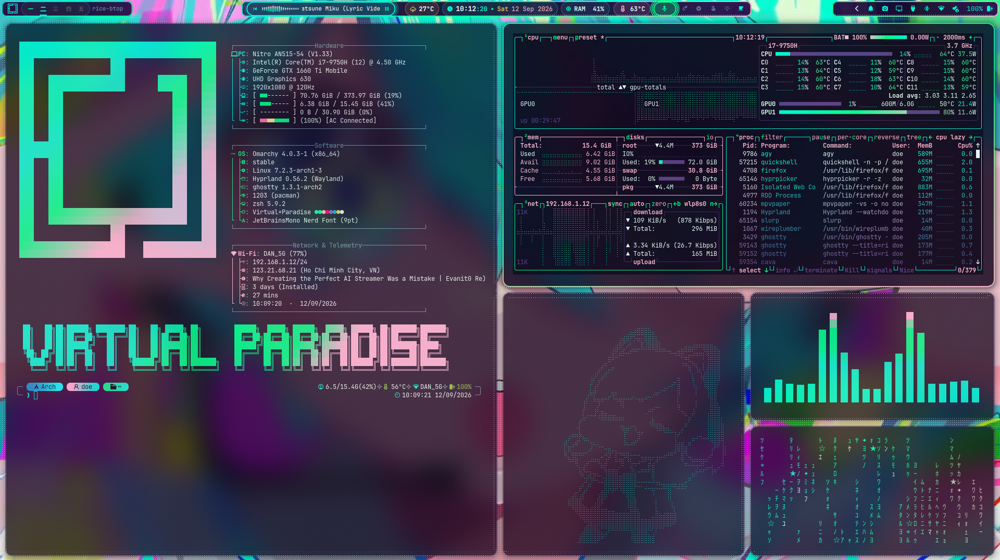
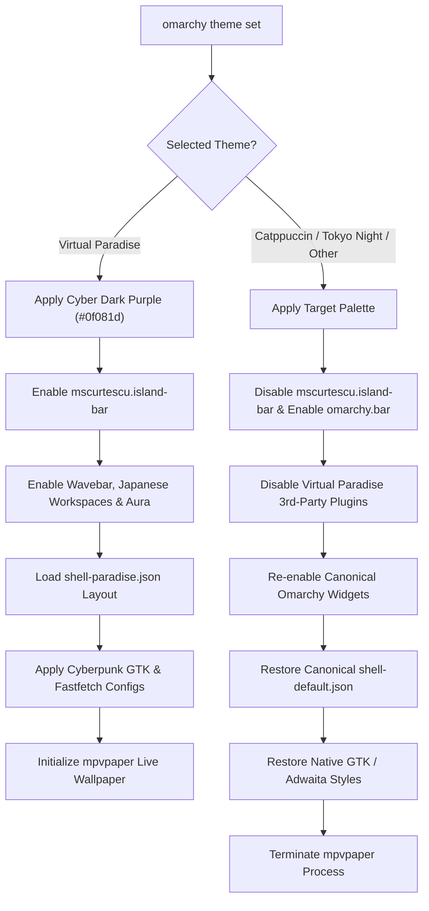

<div align="center">

# Virtual☆Paradise

**Cyber Dark Purple Rice, Audio-Reactive CAVA Waveform, Floating Island Bar & Universal Development Environment for Omarchy Linux**

Arch Linux · Hyprland · Wayland · Quickshell

[](https://archlinux.org)
[](https://hyprland.org)
[](https://github.com/mscurtescu/omarchy-island-bar)
[](https://github.com/llIIllIID0EIIllIIll/virtual-paradise)
[](https://github.com/ErikBurdett/omarchy-wavebar)
[](LICENSE)

</div>

---

Virtual☆Paradise is an advanced, full-topping cyberpunk theme and desktop integration ecosystem crafted specifically for Omarchy Linux (Arch Linux + Hyprland). Built around an ultra-deep night violet canvas (`#0f081d`) accented with glowing Miku Cyan (`#00f5d4`), Sakura Pink (`#ff5287`), and Hacker Green (`#00ff88`), it transforms the desktop into an immersive cyber city workstation without modifying core packaged files in `/usr/share/omarchy`.



*Full 5-terminal development rice featuring CAVA audio waveform, Island Bar, system telemetry, live video wallpaper, and Paradise Agent.*

---

## ⚡ Core Features

### 🌌 Cyber Dark Purple Aesthetic (`#0f081d`)
- **Unified Background Across Applications**: Ghostty, Alacritty, Kitty, Foot, Neovim, Helix, btop, Fastfetch, and Omarchy Quickshell all share the same calibrated night-violet canvas (`#0f081d`).
- **Dynamic Neon Accents**: Vibrant gradients flow across UI components:
  - **Miku Cyan (`#00f5d4`)**: Primary accents, focus rings, active tab indicators, and fastfetch metrics.
  - **Sakura Pink (`#ff5287`)**: Urgent states, decorative gradients, and visual highlights.
  - **Hacker Green (`#00ff88`)**: Occupied workspace indicators, success dialogs, and secondary telemetry.
  - **Cyber Yellow (`#ffe066`)**: Warning indicators and battery status highlights.

### 🏝️ Cyber City 3-Island Floating Bar
- Powered by `mscurtescu.island-bar` and customized with custom glassmorphism styling:
  - **Left Island**: Omarchy App Menu, Japanese Numeral Workspaces (`io.github.tyrichards.workspaces-jap`), and Active Window Title.
  - **Center Island**: Real-time CAVA Wavebar Media Controller (`io.github.erikburdett.wavebar`), Weather Pill, Clock & Date, System Telemetry Pill (`harshith.system-monitor`), and Hardware Indicators.
  - **Right Island**: Miracast/Projector Quick Cast (`io.github.jeffcortez23.omarchy-projector-cast`), Advanced PipeWire Audio Controller (`ssupt.audio-control`), Bluetooth Routing (`ssupt.bluetooth-audio`), Multi-Monitor Configuration (`crmne.hyprmoncfg`), Power Manager (`onlyvishesh.power-manager`), and Notification Drawer.
- **Visual Ricing**: Frosted acrylic glass pills with subtle glowing neon borders, SVG gradient drop-shadows, and smooth micro-interactions.

### 🎵 60–120 FPS CAVA DSP Audio Wavebar
- **High-Performance Waveform Engine**: Powered by an asynchronous backend daemon (`waveform.py`) driving real-time CAVA DSP audio analysis.
- **Monstercat Frequency Smoothing**: Smooth logarithmic frequency distribution across 24 reactive bars with zero frame stutter.
- **Intelligent PipeWire Monitoring**: Automatically attaches to active audio playback sources (Firefox, Spotify, mpv, Chromium) and enters low-overhead sleep mode when idle or silent.
- **Isolated Media Controls**: Dedicated MPRIS media playback bindings that never interfere with `mpvpaper` live wallpapers.

### 💻 5-Terminal Development Rice (`SUPER + Q`)
- Instantly deploys a deterministic 5-pane dwindle layout in milliseconds:
  1. **Terminal 1 (Top Left)**: Fastfetch system overview with high-resolution anime Braille artwork and Paradise Agent prompt.
  2. **Terminal 2 (Top Right)**: `btop` system monitor themed in cyber dark purple with CPU/GPU thermal curves.
  3. **Terminal 3 (Bottom Left)**: `momoisay` fortune speaker with randomized cute anime cyber quotes.
  4. **Terminal 4 (Bottom Center)**: Terminal `cava` visualizer synchronized to active theme gradients.
  5. **Terminal 5 (Bottom Right)**: Tri-color gradient `virtual_matrix` stream (Cyan ➔ Green ➔ Pink).

### 🎬 Hardware-Accelerated Live Wallpaper Engine
- Seamless video & animated GIF background playback powered by `mpvpaper` and hardware VA-API / NVDEC decoding.
- **Cyber Glitch HUD Transition**: Switching wallpapers triggers a momentary cyberpunk HUD overlay with glowing neon scanlines, target name, animated progress bar, and automatic fallback safeguards.

### ❄️ Intelligent Laptop Cooling & Hardware Helpers
- Real-time fan speed boost and embedded controller (EC) control for Acer Nitro (`acer-wmi`), ASUS ROG/TUF (`asusctl`), MSI (`isw`), and NBFC supported laptops via `SUPER + ALT + C`.
- Native NVIDIA GPU persistence management with automated power state calibration.

---

## ⌨️ Keybindings Cheat Sheet

### Window & Workspace Navigation
| Shortcut | Action |
| :--- | :--- |
| `SUPER + Return` | Open Ghostty terminal |
| `SUPER + Q` | Launch 5-terminal development rice layout |
| `SUPER + E` | Open Nautilus file manager (themed with cyberpunk accents) |
| `SUPER + B` | Open default web browser |
| `SUPER + C` | Close focused window |
| `SUPER + V` | Toggle floating window mode |
| `SUPER + F` | Toggle fullscreen |
| `SUPER + 1..9` | Switch to workspace 1..9 (with Japanese indicator updates) |
| `SUPER + SHIFT + 1..9` | Move window to workspace 1..9 |

### Wallpaper & Ricing Controls
| Shortcut | Action |
| :--- | :--- |
| `SUPER + ALT + UP` | Toggle Live Video Wallpaper / Static Canvas |
| `SUPER + ALT + RIGHT` | Next live wallpaper (Glitch transition HUD) |
| `SUPER + ALT + LEFT` | Previous live wallpaper (Glitch transition HUD) |
| `SUPER + N` | Cycle next static theme background |

### Hardware, Screen & Tools
| Shortcut | Action |
| :--- | :--- |
| `SUPER + ALT + C` | Toggle Cooler Boost high-velocity laptop cooling |
| `SUPER + SHIFT + K` | Launch Projector & Wireless Display Cast Manager |
| `SUPER + SHIFT + T` | Open Omarchy theme picker carousel |
| `SUPER + SHIFT + C` | Open color picker with hex copy to clipboard |
| `SUPER + \` | Fullscreen matrix screensaver |
| `SUPER + ALT + V` | Open Voxtype Aura dictation overlay |

---

## 🧩 Omarchy Plugin Architecture

Virtual☆Paradise coordinates multiple first-party and community Quickshell plugins to provide an integrated desktop experience:

| Plugin ID | Component | Role in Virtual☆Paradise |
| :--- | :--- | :--- |
| `mscurtescu.island-bar` | Floating Island Bar | 3-Island layout with `#0f081d` dark glass & glowing SVG neon borders |
| `io.github.erikburdett.wavebar` | WaveBar Visualizer | Audio-reactive 120FPS CAVA waveform with MPRIS track control |
| `io.github.tyrichards.workspaces-jap` | Japanese Workspaces | Minimalist Kanji numeral workspace pills with active underline |
| `io.github.adamcbrewer.voxtype-aura` | Voxtype Aura | Theme-aware voice dictation popup with live recording indicators |
| `crmne.hyprmoncfg` | Multi-Monitor Manager | Hyprland per-output scaling, refresh rate, and layout config |
| `harshith.system-monitor` | System Monitor | Compact RAM & CPU pressure badge with popout metric details |
| `onlyvishesh.power-manager` | Power Manager | Battery health, charging rates, and power profiles |
| `ssupt.audio-control` | Audio Control | PipeWire sink/source selector, volume sliders, and stream mixer |
| `ssupt.bluetooth-audio` | Bluetooth Audio | Device pairing, codec negotiation (LDAC/aptX), and routing |
| `io.github.jeffcortez23.omarchy-projector-cast` | Projector & Cast | Miracast, wireless display, and external presentation modes |
| `jankeesvw.notification-center` | Notification Center | Centralized notification history drawer and Do-Not-Disturb switch |

---

## 🔄 Theme Switching & 100% Isolation

A critical design goal of Virtual☆Paradise is **zero contamination** of other Omarchy themes. All customizations are managed dynamically via `~/.config/omarchy/hooks/theme-set.d/virtual-paradise.sh`:



- When switching to **Catppuccin, Tokyo Night, Nord, etc.**, the hook cleanly disables `mscurtescu.island-bar`, disables all 3rd-party ricing plugins, re-enables standard first-party Omarchy widgets (`omarchy.bar`, `omarchy.clock`, `omarchy.workspaces`, etc.), restores stock `shell.json`, and stops background video rendering.
- When switching back to **Virtual Paradise**, the hook seamlessly re-enables the Island Bar, restores plugin overrides, starts the audio waveform visualizer, and resumes live wallpapers.

---

## 🚀 Installation & Uninstallation

### 1. Automated Installation

Clone the repository and run the installer:

```bash
git clone https://github.com/llIIllIID0EIIllIIll/virtual-paradise.git
cd virtual-paradise
./install.sh
```

#### Installer Options
| Command | Mode | Description |
| :--- | :--- | :--- |
| `./install.sh` | **Full Install** | Complete installation including Plymouth boot animations, SDDM, plugins, and theme configs. (Prompts for sudo when needed) |
| `./install.sh --user-only` | **User Only** | Installs user plugins, bar ricing, wallpapers, binaries, and themes without requiring sudo privileges. |
| `./install.sh --no-boot` | **Skip Boot** | Deploys desktop rice and plugins while skipping Plymouth and SDDM setup. |
| `./install.sh --hook` | **Sync Only** | Re-applies plugin overrides and theme assets without re-running system package checks. |

### 2. Clean Uninstallation

Virtual☆Paradise includes a comprehensive, non-destructive uninstaller:

```bash
# Via repository:
./uninstall.sh

# Or via installed helper:
uninstall-virtual-paradise
```

The uninstaller:
1. Gracefully switches the active theme back to a default stock theme (Catppuccin, Tokyo Night, etc.).
2. Restores the canonical `shell.json` from `shell-default.json`.
3. Disables all Virtual Paradise third-party plugins and re-enables official `omarchy.*` components.
4. Removes theme assets, GTK overrides, and helper binaries from `~/.local/bin`.
5. Creates a timestamped recovery backup in `~/.local/state/virtual-paradise/`.

---

## 🧪 Quality Assurance & Test Matrix

All features, scripts, and components undergo structured verification:

| Test Case | Description | Verification Method | Status |
| :--- | :--- | :--- | :--- |
| **TC-1: Script Syntax & Parsing** | Validates bash syntax, Python byte-compilation, and JSON schema. | `bash -n install.sh uninstall.sh bin/*.sh`<br>`python3 -m py_compile bin/*.py`<br>`jq empty shell/shell.json` | ✅ **PASS** |
| **TC-2: Uninstaller Coexistence** | Verifies clean cleanup, plugin state reset, and fallback theme activation. | `./uninstall.sh --keep-backups`<br>Verified `omarchy.bar` active and zero residual files. | ✅ **PASS** |
| **TC-3: Installer Idempotency** | Verifies flawless re-run and clean deployment from a fresh state. | `./install.sh --user-only`<br>Verified exit code 0, all 12 plugins registered. | ✅ **PASS** |
| **TC-4: Theme Switching Isolation** | Tests round-trip switching between Virtual Paradise and stock themes. | `omarchy theme set "Catppuccin"` ➔ Verify defaults<br>`omarchy theme set "Virtual Paradise"` ➔ Verify restoration | ✅ **PASS** |
| **TC-5: Audio Capture & DSP** | Verifies low-latency CAVA waveform processing over PipeWire. | Supervised `waveform.py --bars 24`<br>Verified active audio sync with Firefox/Spotify. | ✅ **PASS** |
| **TC-6: Palette Uniformity** | Verifies `#0f081d` dark purple across all terminal emulators and shell. | Inspected `ghostty.conf`, `colors.toml`, `alacritty.toml`, `foot.ini`, `kitty.conf`. | ✅ **PASS** |

---

## 📁 Repository Structure

```text
virtual-paradise/
├── assets/          # High-resolution desktop preview screenshots & artwork
├── backgrounds/     # Live MP4/GIF loops and 4K cyberpunk static wallpapers
├── bin/             # Shell launchers, CAVA sync daemon, matrix effect & helpers
├── cava/            # Cava audio visualizer color gradients & configuration
├── config/          # Modern GTK 3/4 CSS overrides and terminal profiles
├── fastfetch/       # Custom Fastfetch configuration with Anime Braille artwork
├── hypr/            # Hyprland window rules, gestures, and cyber animations
├── overrides/       # Scoped QML overrides for Island Bar, Wavebar, Workspaces & Aura
├── plugins/         # User Quickshell widgets cloned and calibrated for the active user
├── plymouth/        # Plymouth boot & shutdown splash animation assets
├── sddm/            # SDDM cyberpunk login display theme
├── shell/           # 3-Island Quickshell layout configuration (shell.json)
├── theme/           # Master color palettes (colors.toml, shell.toml) & app configs
├── install.sh       # Idempotent automated installer with multi-mode flags
└── uninstall.sh     # Clean uninstaller with automatic fallback restoration
```

---

## 📄 License

Distributed under the [MIT License](LICENSE). Built with love for the Omarchy Linux and Arch Linux communities.
